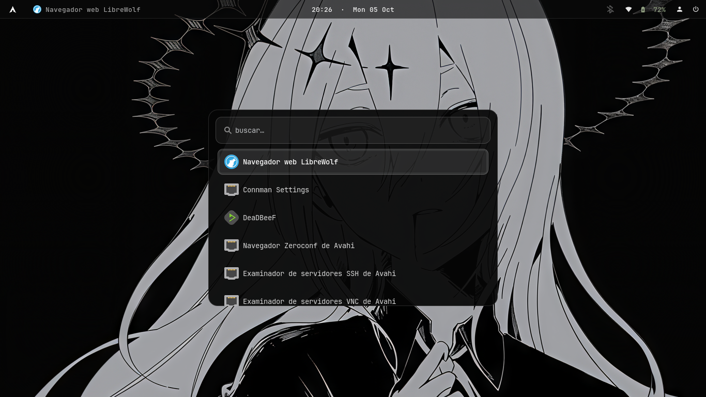

# Dotfiles — Artix Linux + labwc

Este repositorio contiene las configuraciones de usuario (dotfiles) para un entorno de escritorio **Wayland** minimalista basado en **labwc** sobre **Artix Linux**.

Es el complemento perfecto para los scripts de instalación base ([install-artix](https://github.com/tu-usuario/install-artix)). Mientras que los scripts instalan el sistema operativo y los paquetes necesarios, este repositorio se encarga de la apariencia, los atajos de teclado y el comportamiento de tu escritorio.

## 🖼️ Vista Previa

Aquí puedes ver cómo se ve el entorno en acción:



## 📦 Contenido del Repositorio

A continuación se detalla qué configuración encontrarás en cada carpeta:

*   **`labwc/`**: Configuración del compositor Wayland (atajos de teclado, decoraciones de ventanas, reglas, autostart).
*   **`waybar/`**: Barra de estado superior/inferior (módulos, colores, fuentes y scripts).
*   **`wofi/`**: Lanzador de aplicaciones (estilo visual y configuración).
*   **`foot/`**: Emulador de terminal (fuentes, colores, opacidad, atajos).
*   **`mako/`**: Daemon de notificaciones (posición, tiempo de espera, estilos).
*   **`swaylock/`**: Bloqueo de pantalla (imagen de fondo, colores, efectos).
*   **`wlogout/`**: Menú de cierre de sesión (estilo, botones, distribución).
*   **`btop/`**: Monitor de recursos del sistema (tema, diseño).
*   **`fastfetch/`**: Herramienta de información del sistema (logo, módulos, colores).
*   **`gtk-3.0/` y `gtk-4.0/`**: Configuración de temas, iconos y fuentes para aplicaciones GTK.
*   **`lnk/`**: Carpeta para scripts personalizados o enlaces simbólicos adicionales.

## 🛠️ Requisitos Previos

Para que estas configuraciones funcionen correctamente, asegúrate de tener instalados los paquetes necesarios. Si usaste el script `02-post-instalacion.sh` del repositorio `install-artix`, ya deberías tenerlos todos.

Si no es así, instálalos con:
```bash
sudo pacman -S labwc waybar wofi foot mako swaylock wlogout btop fastfetch
